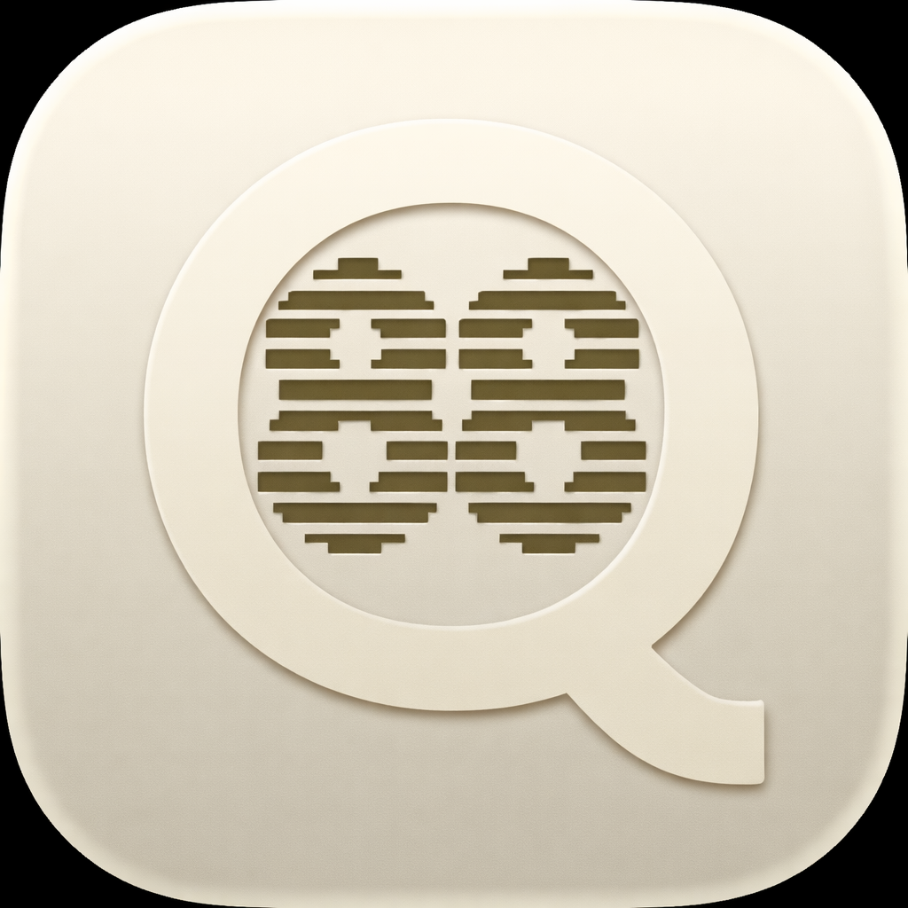
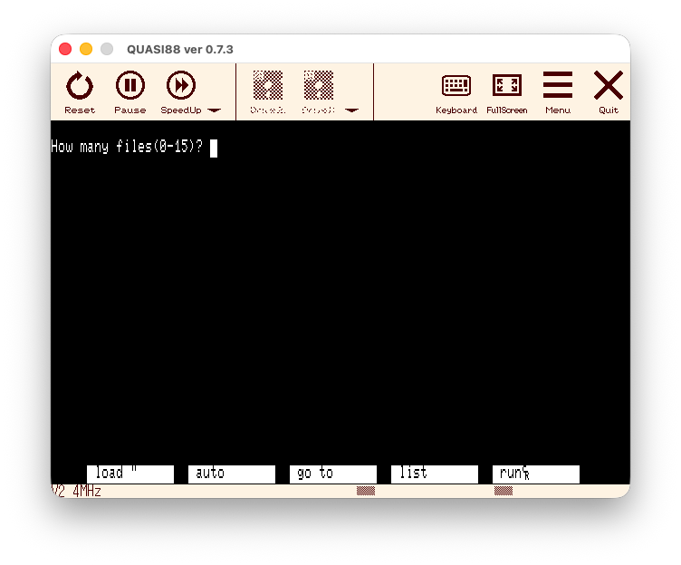

# QUASI88

<p align="center">
  
</p>

This is a macOS build of QUASI88 (https://www.eonet.ne.jp/~showtime/quasi88/).

<p align="center">
  <a href="https://github.com/bubio/QUASI88/releases/latest">
    
  </a>
  <a href="https://github.com/bubio/QUASI88/blob/main/LICENSE">
    
  </a>
  <a href="https://github.com/bubio/QUASI88/releases/latest">
    
  </a>
</p>


QUASI88 is a PC-8801 emulator that allows you to run software for the classic Japanese 8-bit computer on modern systems. It aims to accurately reproduce the PC-8801mkIISR and later models, with support for various features like sound, graphics, and peripherals.

<p align="center">
  
</p>

## Features

QUASI88 emulates various components of the PC-8801:

*   **Z80 CPU**: Both main and sub CPUs.
*   **Memory**: PC-8801mkIISR equivalent, extended RAM, dictionary ROM.
*   **Display**: Text VRAM, VRAM, palette, ALU. Supports 640x200 (8 colors) and 640x400 (monochrome) modes.
*   **Kanji ROM**: Level 1 and Level 2 Kanji ROM.
*   **FDC/FDD**: Major commands for floppy disk control, supporting D88 format.
*   **PIO, Keyboard, Mouse** (Bus mouse, serial mouse), **Joystick**.
*   **Sound**: YM2203, YM2608, BEEP sound. Utilizes MAME/XMAME sound drivers and fmgen (FM Sound Generator).
*   **Tape**: Load/save functionality.
*   **Printer**: Output to file.
*   **RS232C**: Output to file / input from file.
*   **PCG-8100**.

**Not Emulated / Partial Emulation:**

*   Exact timing of interrupts.
*   Most CRTC/DMAC related functions.
*   Non-essential FDC commands, 2DD/2HD disk operations.
*   Clock functions other than time acquisition.
*   Accurate waits.

The emulator's compatibility is generally good, running 70-90% of applications. Performance may vary depending on the complexity of the emulation and your system's hardware.

## Supported Platforms

*   **macOS** (arm64)

## Getting Started

### Prerequisites

Before you can build QUASI88, you need the following tools and libraries:

*   **Xcode Command Line Tools** (or Xcode)
*   **CMake** (version 3.10 or later)
*   **SDL2 development library** (version 2.0.0 or later)

```bash
brew install cmake sdl2
```

### Building

QUASI88 uses CMake for its build system.

1.  **Clone the repository:**
    ```bash
    git clone https://github.com/bubio/QUASI88.git
    cd QUASI88
    ```

2.  **Configure and build:**
    ```bash
    cmake -S. -Bbuild -DCMAKE_BUILD_TYPE=Release
    cmake --build build
    ```
    `build/QUASI88.app` が生成されます。

3.  **DMG パッケージの作成 (optional):**
    ```bash
    cpack --config build/CPackConfig.cmake -G DragNDrop -B build
    ```

### Installation (Release DMG)

Download the DMG from [Releases](https://github.com/bubio/QUASI88/releases) and copy `QUASI88.app` to `/Applications`.

Since the app is not code-signed, macOS Gatekeeper may report it as "damaged". Run the following command to remove the quarantine attribute:

```bash
xattr -cr /Applications/QUASI88.app
```

## Usage

### ROM Images

QUASI88 requires PC-8801 BIOS ROM images to function correctly. These ROM images are not included with the emulator due to copyright reasons. You need to obtain them yourself from a physical PC-8801 or through other means.

**Required ROM files typically include:**

*   `N88.ROM` (N88 BASIC ROM, 32KB)
*   `N88EXT0.ROM` (N88 BASIC Extended ROM Bank 0, 8KB)
*   `N88EXT1.ROM` (N88 BASIC Extended ROM Bank 1, 8KB)
*   `N88EXT2.ROM` (N88 BASIC Extended ROM Bank 2, 8KB)
*   `N88EXT3.ROM` (N88 BASIC Extended ROM Bank 3, 8KB)
*   `N88N.ROM` (N BASIC ROM, 32KB)
*   `N88SUB.ROM` (Sub CPU ROM, 2KB or 8KB)
*   `N88KNJ1.ROM` (Kanji ROM Level 1, 128KB)
*   `N88KNJ2.ROM` (Kanji ROM Level 2, 128KB)
*   `FONT.ROM` (Font Image, optional)

Place your ROM files (case-insensitive filenames are usually fine) in the designated ROM directory. For more details on ROM images and their preparation, refer to `doc/manual.txt` and `doc/get-image.txt`.

### Disk and Tape Images

QUASI88 supports disk images (D88 format) and tape images (CMT/T88 format for loading, CMT only for saving).

*   **D88 Format**: Disk images should be in the D88 format, which is compatible with P88SR.EXE (PC8801mk-2SR emulator). For a detailed technical specification of the D88 format, see `doc/format.txt`.
*   **CMT/T88 Format**: Tape images can be in CMT or T88 format.

You can place your disk and tape images in the respective default directories or specify them via command-line options.

### Running the Emulator

`QUASI88.app` をダブルクリックするか、ターミナルから起動できます:

```bash
open build/QUASI88.app
```

ディスクイメージを指定して起動する場合:

```bash
build/QUASI88.app/Contents/MacOS/QUASI88 [options] [disk_image.d88]
```

For a complete list of command-line options and their usage, please consult `doc/manual.txt`.

### Default Directories

For this macOS build, QUASI88 uses the following default directories. These paths can be overridden by environment variables or command-line options.

*   **ROMs:** `~/Library/Application Support/quasi88/rom/`
*   **Disks:** `~/`
*   **Tapes:** `~/`
*   **Snapshots:** `~/Pictures/quasi88/`
*   **State Saves:** `~/Library/Application Support/quasi88/state/`
*   **Local Config:** `~/Library/Application Support/quasi88/rc/` (for per-image settings)
*   **Global Config:** `~/Library/Application Support/quasi88/` (for general settings)

### Key Operations

QUASI88 emulates a 106-key Japanese keyboard. Some key mappings for PC-8801 specific keys are:

*   **STOP**: `Pause` / `ScrollLock`
*   **COPY**: `PrintScreen`
*   **HOME CLR**: `Home`
*   **HELP**: `End`
*   **ROLL DOWN**: `PageUp`
*   **ROLL UP**: `PageDown`
*   **カナ**: Right `Alt`
*   **GRPH**: Left `Alt`
*   **決定**: Unmapped (often `Muhenkan` key on JP keyboards)
*   **変換**: Unmapped (often `Henkan` key on JP keyboards)
*   **全角**: `Application` key

**Emulator Specific Keys:**

*   **F11**: Toggles toolbar and status display.
*   **F12**: Enters **Menu Mode**.

You can customize key assignments using command-line options (`-f6` to `-f10`) or through the Menu Mode. For more detailed key mappings and customization, refer to `doc/manual.txt`.

### Configuration Files

QUASI88 reads various configuration files to customize its behavior.

*   **Global Configuration File**: Contains general emulator settings.
    *   `~/Library/Application Support/quasi88/quasi88.rc`
    *   The format is one option per line, identical to command-line options (e.g., `-frameskip 2`). Comments start with `#`.
*   **Individual Configuration File**: Loaded if a disk image is specified, allowing per-image settings.
    *   `~/Library/Application Support/quasi88/rc/<disk_image_basename>.rc`
*   **Keyboard Configuration File**: Customizes keyboard mappings.
    *   `~/Library/Application Support/quasi88/rc/keyconf.rc`
*   **Touch Key Configuration File**: Customizes the on-screen touch keyboard.
    *   `~/Library/Application Support/quasi88/rc/touchkey.rc`

Command-line options take precedence over individual config files, which take precedence over global config files.

### Menu Mode

Pressing `F12` or clicking the Menu icon in the toolbar enters **Menu Mode**. This graphical interface allows you to change various emulator settings, manage disk images, and perform other actions using mouse or keyboard navigation.

**Key sections in Menu Mode include:**

*   **Reset**: Change BASIC mode, CPU clock, sound board type, and reset the emulator.
*   **CPU**: Adjust CPU options, clock speed, wait adjustments.
*   **Screen**: Configure frame rate, auto-skip, screen size, PCG-8100, and screen effects.
*   **Volume**: Adjust sound levels for FM, PSG, BEEP, etc.
*   **Disk**: Open/close disk images, swap images, create blank disks.
*   **Key**: Assign functions to function keys, customize cursor keys, toggle key states.
*   **Mouse**: Configure mouse/joystick connections and mappings.
*   **Tape**: Set tape image files for loading/saving.
*   **Other**: State save/load, screenshot options, sound output recording.

For detailed instructions on using Menu Mode, refer to `doc/manual.txt`.

## Troubleshooting

If you encounter issues, here are some common problems and solutions:

*   **Emulator does not start / crashes immediately:**
    *   Ensure SDL2 is correctly installed (`brew install sdl2`).
    *   Check for error messages when launching with `-verbose 1` (add this to `quasi88.rc` or as a command-line option).
    *   Try deleting your configuration files (`quasi88.rc`) to reset settings.
*   **Black screen after launch:**
    *   Verify your ROM images are present in the correct directory and are readable. Use `-verbose 1` to check for ROM loading errors.
*   **Corrupted display:**
    *   The font files (`FONT.ROM`, `N88KNJ1.ROM`) might be an issue. Try temporarily removing them (QUASI88 can use built-in fonts).
*   **Application does not run correctly / freezes:**
    *   Adjust CPU timing options (`-cpu 0`, `-cpu 1`, `-cpu 2`) in Menu Mode (CPU tab) or via command line.
    *   Try `-fdc_wait` for applications sensitive to FDD timing.
*   **Sound issues (no sound, noise, incorrect tempo):**
    *   Ensure sound is enabled (not using `-nosound`).
    *   Adjust sound buffer sizes (`-sdlbufsize`, `-sdlbufnum`) via command line or Menu Mode (Volume tab).
    *   Check `-nowait` option if tempo is too fast/slow. For details, refer to `doc/faq.txt`.
*   **Slow performance:**
    *   QUASI88 is resource-intensive. Consider options like `-autoskip`, `-frameskip`, `-half`, `-nowait` to improve speed. Refer to `doc/faq.txt` for detailed optimization tips.
*   **Persistent key presses / auto-repeat issues:**
    *   If a key is stuck, press and release it again, or enter Menu Mode (which clears most key states).

For a comprehensive list of FAQs and troubleshooting tips, please refer to `doc/faq.txt`.

## License

This project is distributed under the terms of its original license, primarily a revised BSD license. See the `LICENSE` file for more details.

This project incorporates code from:
*   **SDL2**: Licensed under Zlib license.
*   **MAME/XMAME**: Please refer to their respective licenses for details.
*   **fmgen** (FM Sound Generator by cisc): Please refer to its documentation for license information.

## Acknowledgements

QUASI88 was originally created by Shozo Fukunaga (福永省三). This repository aims to maintain and update this classic PC-8801 emulator for modern systems. Special thanks to all original creators, contributors, and those who have provided tools and inspiration, including Marat Fayzullin (fMSX), Nicola Salmoria (MAME), Juan Antonio Marmnez (XMAME), Yumitaro (PC6001V), and cisc (fmgen).
