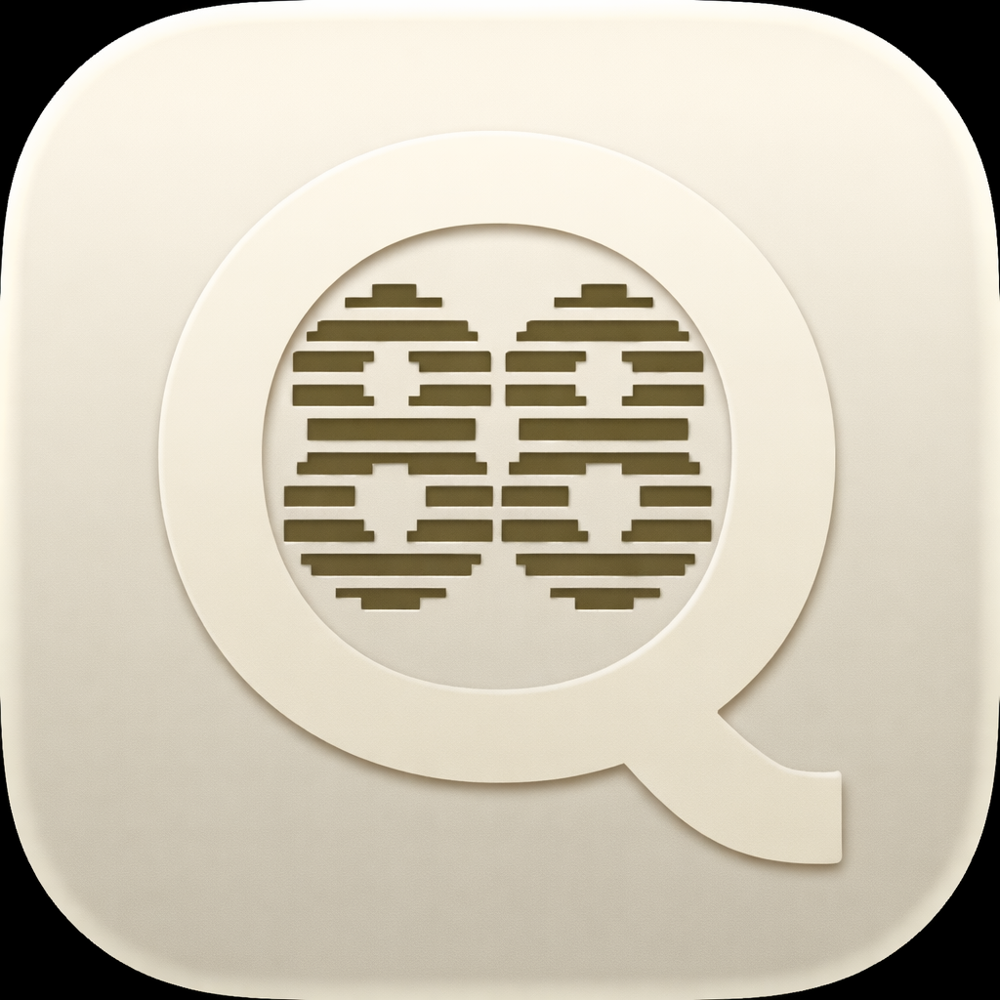
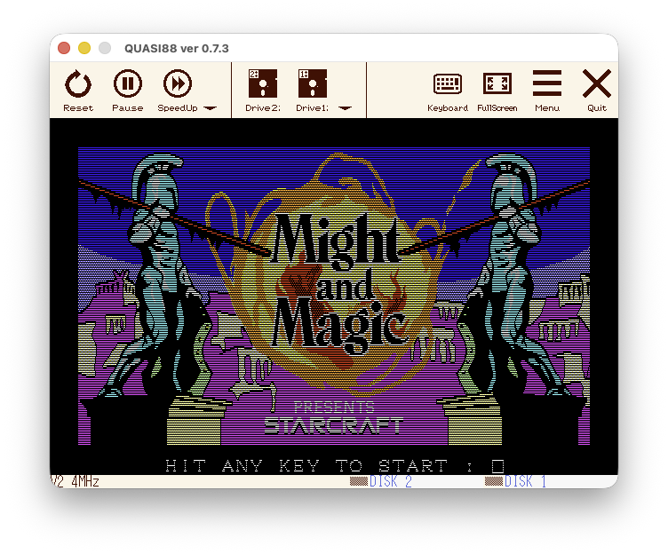

# QUASI88

<p align="center">
  
</p>

QUASI88 is a powerful and highly compatible PC-8801 emulator, originally created by Shozo Fukunaga. This version is a multi-platform port based on SDL2, providing a modern experience across macOS, Windows, and Linux.

<p align="center">
  <a href="https://github.com/bubio/QUASI88/releases/latest">
    
  </a>
  <a href="https://github.com/bubio/QUASI88/blob/main/LICENSE">
    
  </a>
  <a href="https://github.com/bubio/QUASI88/releases/latest">
    
  </a>
</p>

QUASI88 allows you to run software for the classic Japanese 8-bit computer on modern systems. It accurately reproduces the PC-8801mkIISR and later models, with support for various features like sound (including fmgen), graphics, and peripherals.

<p align="center">
  
</p>

## Features

QUASI88 emulates various components of the PC-8801:

*   **Z80 CPU**: Both main and sub CPUs.
*   **Memory**: PC-8801mkIISR equivalent, extended RAM, dictionary ROM.
*   **Display**: Text VRAM, VRAM, palette, ALU. Supports 640x200 (8 colors) and 640x400 (monochrome) modes.
*   **Kanji ROM**: Level 1 and Level 2 Kanji ROM.
*   **FDC/FDD**: Supports D88 format disk images.
*   **Input**: Keyboard, Mouse, Joystick.
*   **Sound**: YM2203, YM2608, BEEP sound. Utilizes MAME/XMAME sound drivers and fmgen.
*   **Tape**: Load/save functionality (CMT/T88 format).
*   **Others**: Printer, RS232C (output to file), PCG-8100.

## Supported Platforms

*   **macOS**: Universal Binary (Apple Silicon & Intel), Standalone `.dmg`.
*   **Windows**: x64, x86, and ARM64. Portable `.zip` packages.
*   **Linux**: x86_64 and arm64. **AppImage** (Standalone), `.deb`, and `.rpm`.
*   **Raspberry Pi**: armhf (32-bit) `.deb` packages.

## Getting Started

### Installation (Pre-built Releases)

Download the latest version for your platform from the [Releases](https://github.com/bubio/QUASI88/releases) page.

*   **Windows**: Just extract the `.zip` file and double-click **`QUASI88.exe`**. No installation or command line required!
*   **macOS**: Open the `.dmg` and copy `QUASI88.app` to your Applications folder.
*   **Linux**: 
    *   **AppImage**: Make the `.AppImage` file executable (`chmod +x`) and run it.
    *   **DEB/RPM**: Use your package manager (e.g., `sudo apt install ./QUASI88.deb`).

### Building from Source

QUASI88 uses CMake for its build system.

**Prerequisites:**
*   **CMake** (version 3.10 or later)
*   **SDL2 development library**

**Install Dependencies:**
*   **macOS**: `brew install cmake sdl2`
*   **Linux**: `sudo apt install cmake libsdl2-dev`
*   **Windows**: Use `vcpkg install sdl2:x64-windows`

**Build Commands:**
```bash
git clone https://github.com/bubio/QUASI88.git
cd QUASI88
cmake -S. -Bbuild -DCMAKE_BUILD_TYPE=Release
cmake --build build
```

## Usage

### ROM Images

QUASI88 requires PC-8801 BIOS ROM images (e.g., `N88.ROM`, `N88SUB.ROM`) to function. Place them in the default ROM directory for your platform. Refer to `doc/manual.txt` for a full list of required files.

### Default Directories

| Platform | BIOS ROMs (`ROM_DIR`) | Config Files (`G_CFG_DIR`) | Disk Images (`DISK_DIR`) |
| :--- | :--- | :--- | :--- |
| **macOS** | `~/Library/Application Support/quasi88/rom/` | `~/Library/Application Support/quasi88/` | `~/` |
| **Linux** | `~/.local/share/quasi88/rom/` | `~/.config/quasi88/` | `~/` |
| **Windows** | `.\ROM\` (relative to EXE) | `.\` (relative to EXE) | `.\DISK\` |

### Key Operations

*   **F12**: Enter **Menu Mode** (Settings, Disk management, etc.)
*   **F11**: Toggle toolbar and status display.
*   **STOP**: `Pause` / `ScrollLock`
*   **HOME CLR**: `Home`
*   **HELP**: `End`

## Troubleshooting

If you encounter issues, please check the [FAQ](doc/faq.txt) or the [Manual](doc/manual.txt). Common issues include:
*   **Missing ROMs**: Ensure BIOS files are in the correct directory.
*   **macOS Permissions**: Since the app is not signed, you may need to run `xattr -cr /Applications/QUASI88.app` if macOS prevents it from opening.

## License

This project is distributed under the terms of its original license (Revised BSD-style). See the `LICENSE` file for details. It incorporates code from SDL2 (Zlib), MAME/XMAME, and fmgen.

## Acknowledgements

Original creator: **Shozo Fukunaga**.
Special thanks to the contributors of SDL2, MAME, and fmgen.
